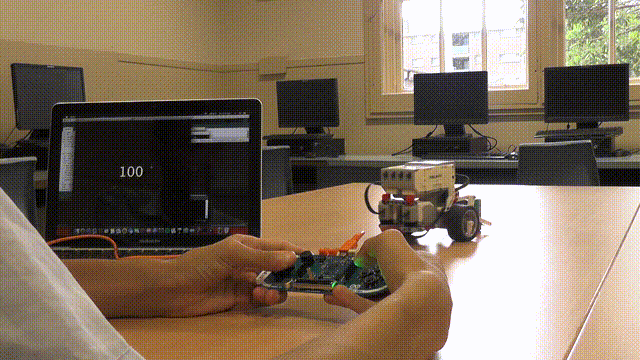

# P.A.R.C

- Processing Arduino Remote Control (PARC) allows users to control a Lego Mindstorms robot using an Arduino Esplora device.
- Made in 2017 (10th grade) and uploaded 2019. 
- First Place Prize of the MadMaker Competition. 
